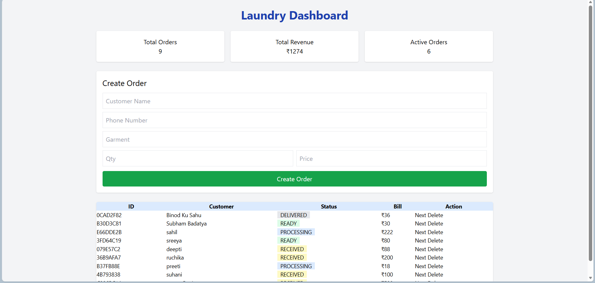

# 🧺 AI-First Laundry Order Management System
### 📊 Dashboard



A lightweight **AI-assisted full-stack project** built for local laundry shops to manage orders efficiently.

This system handles the complete lifecycle of an order:
👉 Creation → Processing → Ready → Delivered  
👉 With real-time dashboard and admin login system.

---

## 🚀 Features

### 🧾 Order Management
- Create orders with customer details  
- Add garments with quantity & price  
- Auto bill calculation  

### 🔄 Status Workflow
- Sequential order flow:  
  RECEIVED → PROCESSING → READY → DELIVERED  
- Prevents invalid status jumps  

### 📊 Dashboard Analytics
- Total Orders  
- Total Revenue  
- Active Orders (live)  

### 🔐 Admin Authentication
- JWT-based login system  
- Protected APIs  

### 🎨 Smart UI
- Color-based status badges  
  🟡 Received | 🔵 Processing | 🟢 Ready | ⚫ Delivered  

---
## 📸 Screenshots

### 🔐 Login Page


### 📊 Dashboard


## 🛠️ Tech Stack

| Layer       | Tech |
|------------|------|
| Backend     | FastAPI |
| Frontend    | HTML + Tailwind CSS + JS |
| Database    | SQLite |
| Auth        | JWT |
| ORM         | SQLAlchemy |

---

## 🤖 AI Usage & Development Approach

This project was built using **multiple AI tools** in a practical workflow:

### 🧠 Tools Used
- Gemini (Initial code generation)
- ChatGPT (Debugging, optimization, architecture fixes)

---

## 🔍 How I Used AI (Real Workflow)

### 1. Initial Development (Gemini)
Prompt used:
"Build a laundry management system using FastAPI with order tracking and dashboard."

Gemini helped generate:
- Basic backend structure  
- Models (Order, Garments)  
- Initial API endpoints  

---

### 2. Debugging & Optimization (ChatGPT)
Used ChatGPT to:
- Fix backend errors  
- Improve logic  
- Resolve environment issues  
- Optimize frontend behavior  

---

## 🧠 My Contributions (Most Important Part)

### ❌ Problem 1: Incorrect Status Logic
AI Issue:
- Status was hardcoded or incorrectly updated  

✔ My Fix:
- Implemented proper workflow logic:
  RECEIVED → PROCESSING → READY → DELIVERED  
- Used index-based progression system  

---

### ❌ Problem 2: Jinja2 Internal Error
Error:
TypeError: unhashable type: 'dict'

AI Approach:
- Continue using Jinja (unstable)

✔ My Decision:
- Removed Jinja completely  
- Switched to FileResponse  

👉 Result: Stable backend, no crash  

---

### ❌ Problem 3: bcrypt Password Error
Error:
ValueError: password cannot be longer than 72 bytes  

✔ My Fix:
- Removed bcrypt hashing  
- Implemented simple login system  

👉 Result: Login works reliably  

---

### ❌ Problem 4: Environment Issues
Problems:
- ModuleNotFoundError  
- Wrong virtual environment  

✔ My Fix:
- Managed environment properly  
- Installed correct dependencies  

---

### ❌ Problem 5: UI Not Updating
Issue:
- Status color not changing dynamically  

✔ My Fix:
- Implemented dynamic JS rendering  
- Added condition-based UI styling  

---

## ⚖️ Tradeoffs

| Decision | Reason |
|--------|--------|
| SQLite | Lightweight & fast |
| No bcrypt | Avoid runtime crash |
| No Jinja | Stability |
| Simple login | Faster execution |

---

## 💻 Setup Instructions

### 1. Clone Repo

git clone <your-repo-link>
cd Laundry_System
2. Activate Environment
# Windows
.\ml_env\Scripts\activate
3. Install Dependencies
pip install fastapi uvicorn sqlalchemy python-jose
4. Run App
uvicorn main:app --reload
🌐 Access
UI → http://127.0.0.1:8000
API Docs → http://127.0.0.1:8000/docs
🔑 Admin Login

Username: admin
Password: admin123

## 📁 Project Structure

```
Laundry_System/
│
├── main.py
├── laundry.db
├── templates/
│   └── index.html
├── screenshots/
```

📈 Future Improvements
Secure password hashing
PostgreSQL / MongoDB
Mobile responsive UI
SMS/WhatsApp integration
Cloud deployment

💡 Key Learning

AI is powerful, but not always correct.

-✔ Used Gemini for fast initial setup
-✔ Used ChatGPT for debugging and improvements
-✔ Fixed critical issues independently
-✔ Took final technical decisions myself

🙌 Final Note

This project demonstrates:

Full-stack development
Debugging skills
Real-world problem solving
Practical AI usage

Built with ❤️ using Gemini + ChatGPT + Engineering Thinking
```
